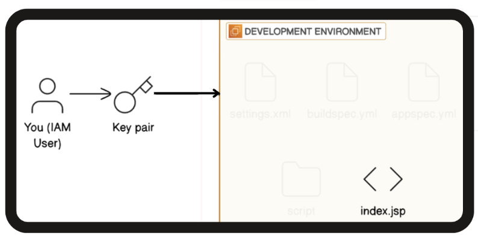

# ☁️ Set Up a Web App in the Cloud

This project demonstrates how to deploy a Java-based web application on an AWS EC2 instance using VSCode and Maven. It was completed as part of the [NextWork DevOps Challenge](https://learn.nextwork.org/projects/aws-devops-vscode).

## 🔁 Data Flow Diagram

Below is the high-level architecture of this project:



## 📌 Project Overview

The objective was to:

- Launch an EC2 instance on AWS.
- Connect to the instance using VSCode's Remote-SSH.
- Install Java and Maven on the EC2 instance.
- Generate a Java web application using Maven.
- Explore and edit the application using VSCode.

## 🛠️ Tools & Technologies

| Tool/Service       | Purpose                                  |
|--------------------|------------------------------------------|
| **AWS EC2**        | Virtual server to host the web app       |
| **VSCode**         | Code editor with Remote-SSH capabilities |
| **Maven**          | Build automation tool for Java projects  |
| **Java (Corretto 8)** | Java Development Kit for the application |

## 🚀 Steps to Reproduce

### 1. Launch an EC2 Instance

- Use the AWS Console to launch a new EC2 instance.
- Choose Amazon Linux 2023 AMI.
- Select `t2.micro` instance type.
- Create a new key pair (e.g., `nextwork-keypair.pem`) and download it.
- Configure security group to allow SSH (port 22) from your IP.

### 2. Set Up VSCode

- Install [Visual Studio Code](https://code.visualstudio.com/).
- Install the **Remote - SSH** extension.
- Configure SSH in VSCode:

  ```bash
  Host my-ec2-instance
      HostName <EC2_PUBLIC_IP>
      User ec2-user
      IdentityFile ~/.ssh/nextwork-keypair.pem

* Connect to the EC2 instance via VSCode.

3. Install Java and Maven on EC2
	•	Update the package manager:

    sudo yum update -y

	•	Install Java (Amazon Corretto 8):

    sudo yum install java-1.8.0-amazon-corretto -y

    •	Install Maven:

    sudo yum install maven -y

4. Generate Java Web Application
	•	Use Maven to generate a web application:

    mvn archetype:generate \
  -DgroupId=com.nextwork.app \
  -DartifactId=nextwork-web-project \
  -DarchetypeArtifactId=maven-archetype-webapp \
  -DinteractiveMode=false

  	•	Navigate to the project directory:

    cd nextwork-web-project

5. Explore and Edit in VSCode
	•	In VSCode, open the nextwork-web-project folder.
	•	Explore the project structure:
	•	src/main/webapp: Contains HTML, JSP files.
	•	pom.xml: Maven configuration file.

## 📎 Documentation

For a detailed walk-through with step-by-step notes, refer to:

[📄 Cloud Web App Setup.pdf](./Cloud%20Web%20App%20Setup.pdf)